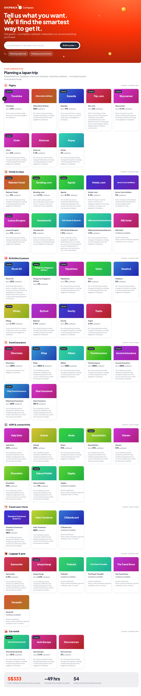

# ShopBack Compass

**Tell us what you want, and we'll find the smartest way to get it** — one goal in, a complete, cashback-ranked plan out, assembled across everything you'll need.

A prototype that flips ShopBack from a *store directory you search* into an *intent engine you state a goal to*. You say "planning a Japan trip" or "setting up my new home"; Compass decomposes it into every sub-need — **including the ones people forget** (travel insurance, an eSIM, home contents cover) — and fills each with real ShopBack stores ranked by cashback.



## Why it matters
Shopping happens by **need** ("I'm setting up a home"), but tools are organised by **store**, so you're left mapping *which shops sell this* and *which have cashback* yourself — and missing whole categories. Compass does that assembling for you: the spend is already happening; this removes the burden and the blind spots.

## How it works — and where an LLM is *not* used
- **Real data.** Built on ShopBack SG's actual catalogue (**1,184 live stores**) with cashback rates + fine print scraped from their public store pages. See `public/data/`.
- **LLM decomposes; code retrieves and ranks.** An LLM turns a fuzzy goal into labelled sub-needs and picks relevant stores — the one genuinely reasoning-shaped step. **Retrieval and cashback ranking are deterministic** (no model), and the model is **grounded to real store slugs**, so it can never invent a store, rate, or caveat.
- **Two paths.** The hero intents (Japan trip / new home) render from curated real data; any **free-text** goal is decomposed live via `/api/plan`.

### Scaling (not built here)
At 20k+ merchants, build-time **embeddings** replace hand-tagging for retrieval, while the LLM still does the decomposition; the same engine could also run proactively off ShopBack's cross-merchant purchase graph.

## Tech
Next.js (App Router) · TypeScript · Tailwind v4 · Vitest. LLM via any OpenAI-compatible endpoint (configured for DeepSeek by default).

## Run locally
```bash
npm install
cp .env.local.example .env.local   # add your LLM key
npm run dev                          # http://localhost:3000
npm test                             # ranking + grounding unit tests
```

## Disclaimer
Independent prototype for a product exercise. **Not affiliated with or endorsed by ShopBack.** ShopBack branding and merchant names belong to their respective owners; cashback rates are a point-in-time snapshot and may be out of date.
